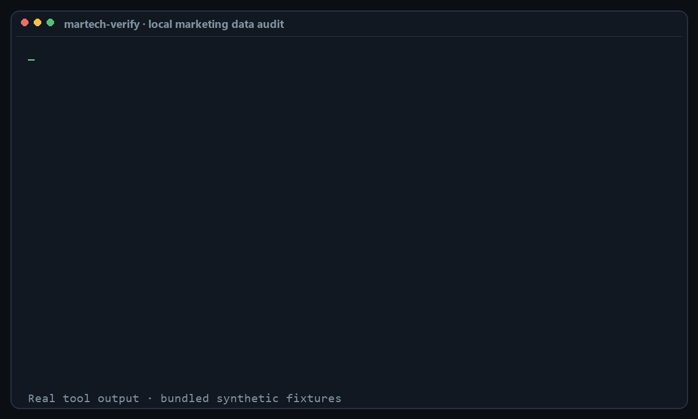

# martech-verify

Give Codex or Claude Code the marketing exports you already have and get evidence you can
act on: where personal data is leaking, which campaign links are broken, why conversions
disagree, and where lead-routing rules fail. No SaaS account, API key, or connector.

[Install](#start-here) · [Download v0.2.0](https://github.com/m7mdwb/martech-verify/releases/tag/v0.2.0)



*Real output from the bundled synthetic fixtures. The source exports are never modified.*

## Start here

Install the bundle, add one or more exports to your working folder, and ask the umbrella
skill to choose the relevant checks.

**Codex** — paste this into Codex:

```text
$skill-installer Install all skills from https://github.com/m7mdwb/martech-verify
```

Then run:

```text
$martech-audit Audit the marketing exports in this folder. Tell me what to fix first,
what needs investigation, and what the files cannot prove.
```

**Claude Code** — install from the repository's marketplace:

```bash
claude plugin marketplace add m7mdwb/martech-verify
claude plugin install martech-verify@martech-verify
```

Then run:

```text
/martech-verify:martech-audit Audit the marketing exports in this folder. Prioritize the
findings and explain them without exposing raw customer data.
```

`martech-audit` is the front door, not another scanner. It inspects the supplied filenames
and headers, selects the smallest useful set of specialist skills, runs their bundled
deterministic tools, and combines the evidence into **Fix now**, **Investigate**, and
**Coverage**. You can also call any specialist directly.

## What to provide

| Your question | Give it | What you get |
|---|---|---|
| Is customer data leaking into analytics? | A CSV, JSON, JSONL or text export containing page URLs or event values | Verified and suspected PII findings, redacted and ranked |
| Why is traffic `Unassigned` or misattributed? | A URL export from ads, email, analytics, or a campaign sheet | Broken, conflicting and inconsistent UTM tags with suggested fixes |
| Why does the ad platform say 400 conversions while the CRM says 260? | Two row-level CSV exports with a shared conversion ID | Join coverage, the size of the gap, ranked causes and supporting counts |
| Are leads reaching the right owner? | A lead CSV plus routing rules transcribed into the small JSON rule format | Dead, shadowed and invalid rules, unrouted leads and load imbalance |

Each specialist includes a short input guide with a minimal example and common export
sources: [`pii-scan`](skills/pii-scan/references/input-guide.md),
[`utm-lint`](skills/utm-lint/references/input-guide.md),
[`conversion-reconcile`](skills/conversion-reconcile/references/input-guide.md), and
[`routing-simulate`](skills/routing-simulate/references/input-guide.md).

## Privacy and safety model

- The bundled Python tools are read-only, use only the standard library, make no network
  calls, and collect no telemetry.
- Findings redact sensitive values. The agent workflows explicitly avoid echoing raw rows
  or personal data into the conversation.
- Codex or Claude may still process selected file context according to your provider and
  organisation settings. Use exports you are permitted to process.
- Results describe only the supplied files and period. They are not a compliance
  certification or proof that every tracking path is correct.

## Why another marketing skills repo

There are about 150 marketing skills published for Claude across the largest public
collections. Nearly all of them share two properties:

**The free ones give advice. The ones that read your data want an account.** Schema
references, naming conventions, checklists, templates. The moment a skill touches real
numbers it needs an API key, an OAuth grant or a subscription.

**Every audit stays inside one platform's own configuration.** A tag manager audit reads
the tag manager. A GA4 audit reads GA4 settings. Nothing looks across a boundary.

That second one is the expensive gap, because the failures that cost real money are
invisible from inside a single platform:

- A tag-manager trigger with a regex that matches too broadly. The container is valid.
  Correct tags, no orphans, clean naming. It just fires three to four times more often
  than it should, and for months the top of the funnel looks healthier than it is.
- A phone system reporting 331 call records against 114 real calls.
- A cost-per-qualified-lead definition that quietly under-counts. The platform is doing
  exactly what it was told. The instruction was wrong.

None of those are configuration errors. They are disagreements between what a system
reports and what actually happened, and you find them by putting two systems side by side.

## Skills

| Skill | Role | What it answers |
|---|---|---|
| [`martech-audit`](skills/martech-audit) | Start here | Which checks fit these files, what matters most, and what could not be checked? |
| [`pii-scan`](skills/pii-scan) | Specialist | Is personal data leaking into our analytics URLs and event parameters? |
| [`utm-lint`](skills/utm-lint) | Specialist | Which tagged URLs broke the taxonomy, and what should they be? |
| [`conversion-reconcile`](skills/conversion-reconcile) | Specialist | The platform says 400, the CRM says 260. Which likely cause fits the evidence? |
| [`routing-simulate`](skills/routing-simulate) | Specialist | Where does each lead land, which rules never fire, and which are shadowed? |

The four specialists are executable workflows, not prompt-only advice. The agent runs the
bundled tool, interprets its `0`/`1`/`2` result correctly, explains the evidence in plain
language, and preserves the tool's safety boundaries.

## Direct command-line use

The scripts also run without an agent. They require Python 3.9+ and no packages.

```bash
git clone https://github.com/m7mdwb/martech-verify.git
python martech-verify/skills/pii-scan/scripts/scan.py your-export.csv
```

## Try it without your own data

Every skill ships a fixture with known planted defects, so you can see the output before
you point it at anything real.

```bash
python skills/pii-scan/scripts/scan.py fixtures/pii-scan/ga4_pages_sample.csv
```

```
pii-scan · 18 values read from ga4_pages_sample.csv (column 'page_location')
==============================================================================
  12 affected values — 7 critical · 3 high · 2 medium

  severity  kind            parameter                count  example
  --------- --------------- ---------------------- -------  ------------------------
  critical  email           email                        1  ! m***@g***.com
  critical  email           u                            1  ! m***@g***.com
                            └─ (found base64-encoded)
  critical  phone           phone                        1  ! +3********56
  critical  credit_card     (path)                       1  ! 45************86
  critical  iban            iban                         1  ! GB************32
  critical  jwt             token                        1  ! ey************Rh
  ...

  ! the value itself was verified   ? the parameter name says so, the value was not verified
```

## The flagship, in one screen

```
  platform     420 rows
  crm          246 rows   ratio 1.71  (+71%)
  joined on 'transaction_id': 246 matched · 174 platform-only · 0 crm-only

  RANKED CAUSES
  1. trigger_matching_too_broadly   (confidence 0.90)
     The excess is not spread out. It is almost all on one value of 'page_path'.

       Evidence: 174 of 174 unmatched platform rows (100%) carry
       page_path='/checkout/success', while that value accounts for only 24%
       of rows that did match. A systemic problem inflates everything evenly;
       this does not.

       What to do: Read the trigger behind the conversion tag on that path.
       The usual cause is a 'contains' or regex condition matching more pages
       than intended — a path regex without anchors is the classic.
```

Four synthetic scenarios ship with the repo — clean, duplicated events, a trigger firing on
one path, a one-day timezone offset. The test asserts each gets the right top diagnosis and
that the three faulty ones get three *different* ones, because a detector that always
answered "duplicate events" would pass a single-scenario test and be useless.

## Non-goals

Stated because half of what a reader might call a gap here is a decision, and a repo that
does not say which is which invites the same question forever.

**No connectors, and this one is load-bearing.** No CRM, analytics, ads or warehouse
integrations, now or later. The reason this exists at all is that every free skill in this
space gives advice while every skill that reads real data needs an API key or a
subscription. "Point it at a CSV you already have" is not a limitation to be fixed. It is
the position. Adding connectors makes this the 151st marketing skill collection, competing
on someone else's terms.

**No service.** No auth, no multi-tenancy, no job queue, no retries, no audit log, no
approvals, no rollback. These are four scripts that read a file on your machine. Every one
of those features would make them worse at that.

**No agent framework.** No manager/worker separation, no scheduling, no memory, no
privilege promotion. Interesting; different repo.

**The confidence numbers are heuristic weights, not calibrated probabilities.** They
express how well a divergence fits a known shape. Calibrating them would need labelled
production outcomes, which nobody has. Every diagnosis therefore states the counts behind
it, so you can check the reasoning instead of trusting the number.

**Not built for warehouse-scale files.** Inputs are read into memory. A month of exports is
comfortable; a hundred million rows is not, and streaming will be added when someone
actually hits the wall rather than in anticipation of it.

**`routing-simulate` models its own small DSL, not LeanData or Salesforce semantics.** You
transcribe your rules into it. That transcription is deliberate — writing the rules out in
one place is where a surprising share of the findings come from.

## Principles

**Verified beats suspected, and the report says which.** An email that parses is not the
same claim as a parameter called `email`. Tools that blur the two get ignored.

**Never print what you just flagged.** Every value is redacted, in the table, in the
locations and in the JSON. The redaction test failed on the first run and caught the
scanner reprinting a card number that lived in a URL path — which is exactly the bug the
scanner exists to find, committed by the scanner.

**A false positive is more expensive than a missed finding.** One wrong alarm and nobody
opens the report again. `example.com` addresses, Luhn-failing order IDs and ordinary
campaign parameters stay silent.

**Silence is a result.** A clean run says so plainly rather than implying a clean bill of
health, and the repaired routing fixture is tested for producing *no* output — a linter that
still complains after you fixed everything it asked for is one nobody fixes anything for.

**Say what the answer does not cover.** These read the export you supplied. A one-month
export answers a one-month question, and the tool says so rather than implying a clean bill
of health.

## Tests

```bash
python tests/run_all.py
```

No test framework, no dependencies. Each fixture has planted defects and the tests assert
the skill finds exactly those and invents nothing.

`test_malformed_input.py` runs every skill against every way a real export is broken —
empty, header-only, ragged rows, a BOM, cp1252 from Excel, a truncated JSON-lines file, a
200,000-character field, NUL bytes, and a PNG renamed to `.csv`. The contract is narrow and
absolute: **never traceback, exit 0/1/2 and nothing else, and if you give up say something
a human can act on.** It also fails if an unreadable or ambiguous file produces a clean
verdict: empty and header-only exports, binary or NUL-containing files, malformed JSON
Lines, duplicate headers and ragged rows must exit 2. BOMs, cp1252, CRLF, long fields and
other valid edge cases must continue to work.

`test_fixture_bytes.py` asserts the properties Git would otherwise silently erase: the CRLF,
BOM and cp1252 bytes, missing final newline, NUL and PNG signatures, and the field exceeding
the old CSV limit. `.gitattributes` prevents normalisation in transit; this test proves the
stored fixtures still mean what their names claim.

The animated README demo is not a hand-edited mock-up. `tools/make_demo_gif.py` reruns all
four specialists over their synthetic fixtures and embeds a fingerprint of the real JSON
results. CI fails when the code, fixtures or animation disagree. Regenerating the GIF uses
Pillow as a development tool; the skills themselves remain standard-library only.

Skills have to work when someone drops a single folder into `.claude/skills/`, so no skill
imports from outside itself. `lib/_shared.py` is the source of truth and
`tools/sync_shared.py` vendors it into each skill; `tests/test_shared_sync.py` fails if a
copy has drifted. Edit the source, run the sync, commit the copies.

## Licence

MIT.
