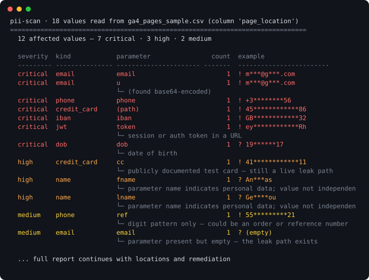

# martech-verify

Verification skills for marketing and revenue operations. They run on an export you
already have, they cross the boundary between systems, and they have no dependencies.



## Why another marketing skills repo

There are about 150 marketing skills published for Claude across the largest public
collections. Nearly all of them share two properties:

**The free ones give advice. The ones that read your data want an account.** Schema
references, naming conventions, checklists, templates. The moment a skill touches real
numbers it needs an API key, an OAuth grant or a subscription.

**Every audit stays inside one platform's own configuration.** A tag manager audit reads
the tag manager. A GA4 audit reads GA4 settings. Nothing looks across a boundary.

That second one is the expensive gap, because the failures that cost real money are
invisible from inside a single platform:

- A tag-manager trigger with a regex that matches too broadly. The container is valid.
  Correct tags, no orphans, clean naming. It just fires three to four times more often
  than it should, and for months the top of the funnel looks healthier than it is.
- A phone system reporting 331 call records against 114 real calls.
- A cost-per-qualified-lead definition that quietly under-counts. The platform is doing
  exactly what it was told. The instruction was wrong.

None of those are configuration errors. They are disagreements between what a system
reports and what actually happened, and you find them by putting two systems side by side.

## Skills

| Skill | Status | What it answers |
|---|---|---|
| [`pii-scan`](skills/pii-scan) | ✅ shipped | Is personal data leaking into our analytics URLs and event parameters? |
| [`utm-lint`](skills/utm-lint) | ✅ shipped | Which of our tagged URLs broke the taxonomy, and what should they be? |
| [`conversion-reconcile`](skills/conversion-reconcile) | ✅ shipped | The platform says 400, the CRM says 260. Which of the seven usual causes is it? |
| [`routing-simulate`](skills/routing-simulate) | ✅ shipped | Where does each lead actually land, which rules never fire, which are shadowed? |

All four shipped. Four finished skills are worth more than nine half-built ones, so
this is the set — additions have to earn their place against that.

## Install

Clone it, or drop a skill folder into your `.claude/skills/` directory. Nothing to install:
Python 3.9+, standard library only.

```bash
git clone https://github.com/m7mdwb/martech-verify.git
python martech-verify/skills/pii-scan/scripts/scan.py your-export.csv
```

## Try it without your own data

Every skill ships a fixture with known planted defects, so you can see the output before
you point it at anything real.

```bash
python skills/pii-scan/scripts/scan.py fixtures/pii-scan/ga4_pages_sample.csv
```

```
pii-scan · 18 values read from ga4_pages_sample.csv (column 'page_location')
==============================================================================
  12 affected values — 7 critical · 3 high · 2 medium

  severity  kind            parameter                count  example
  --------- --------------- ---------------------- -------  ------------------------
  critical  email           email                        1  ! m***@g***.com
  critical  email           u                            1  ! m***@g***.com
                            └─ (found base64-encoded)
  critical  phone           phone                        1  ! +3********56
  critical  credit_card     (path)                       1  ! 45************86
  critical  iban            iban                         1  ! GB************32
  critical  jwt             token                        1  ! ey************Rh
  ...

  ! the value itself was verified   ? the parameter name says so, the value was not verified
```

## The flagship, in one screen

```
  platform     420 rows
  crm          246 rows   ratio 1.71  (+71%)
  joined on 'transaction_id': 246 matched · 174 platform-only · 0 crm-only

  RANKED CAUSES
  1. trigger_matching_too_broadly   (confidence 0.90)
     The excess is not spread out. It is almost all on one value of 'page_path'.

       Evidence: 174 of 174 unmatched platform rows (100%) carry
       page_path='/checkout/success', while that value accounts for only 24%
       of rows that did match. A systemic problem inflates everything evenly;
       this does not.

       What to do: Read the trigger behind the conversion tag on that path.
       The usual cause is a 'contains' or regex condition matching more pages
       than intended — a path regex without anchors is the classic.
```

Four synthetic scenarios ship with the repo — clean, duplicated events, a trigger firing on
one path, a one-day timezone offset. The test asserts each gets the right top diagnosis and
that the three faulty ones get three *different* ones, because a detector that always
answered "duplicate events" would pass a single-scenario test and be useless.

## Non-goals

Stated because half of what a reader might call a gap here is a decision, and a repo that
does not say which is which invites the same question forever.

**No connectors, and this one is load-bearing.** No CRM, analytics, ads or warehouse
integrations, now or later. The reason this exists at all is that every free skill in this
space gives advice while every skill that reads real data needs an API key or a
subscription. "Point it at a CSV you already have" is not a limitation to be fixed. It is
the position. Adding connectors makes this the 151st marketing skill collection, competing
on someone else's terms.

**No service.** No auth, no multi-tenancy, no job queue, no retries, no audit log, no
approvals, no rollback. These are four scripts that read a file on your machine. Every one
of those features would make them worse at that.

**No agent framework.** No manager/worker separation, no scheduling, no memory, no
privilege promotion. Interesting; different repo.

**The confidence numbers are heuristic weights, not calibrated probabilities.** They
express how well a divergence fits a known shape. Calibrating them would need labelled
production outcomes, which nobody has. Every diagnosis therefore states the counts behind
it, so you can check the reasoning instead of trusting the number.

**Not built for warehouse-scale files.** Inputs are read into memory. A month of exports is
comfortable; a hundred million rows is not, and streaming will be added when someone
actually hits the wall rather than in anticipation of it.

**`routing-simulate` models its own small DSL, not LeanData or Salesforce semantics.** You
transcribe your rules into it. That transcription is deliberate — writing the rules out in
one place is where a surprising share of the findings come from.

## Principles

**Verified beats suspected, and the report says which.** An email that parses is not the
same claim as a parameter called `email`. Tools that blur the two get ignored.

**Never print what you just flagged.** Every value is redacted, in the table, in the
locations and in the JSON. The redaction test failed on the first run and caught the
scanner reprinting a card number that lived in a URL path — which is exactly the bug the
scanner exists to find, committed by the scanner.

**A false positive is more expensive than a missed finding.** One wrong alarm and nobody
opens the report again. `example.com` addresses, Luhn-failing order IDs and ordinary
campaign parameters stay silent.

**Silence is a result.** A clean run says so plainly rather than implying a clean bill of
health, and the repaired routing fixture is tested for producing *no* output — a linter that
still complains after you fixed everything it asked for is one nobody fixes anything for.

**Say what the answer does not cover.** These read the export you supplied. A one-month
export answers a one-month question, and the tool says so rather than implying a clean bill
of health.

## Tests

```bash
python tests/run_all.py
```

No test framework, no dependencies. Each fixture has planted defects and the tests assert
the skill finds exactly those and invents nothing.

`test_malformed_input.py` runs every skill against every way a real export is broken —
empty, header-only, ragged rows, a BOM, cp1252 from Excel, a truncated JSON-lines file, a
200,000-character field, NUL bytes, and a PNG renamed to `.csv`. The contract is narrow and
absolute: **never traceback, exit 0/1/2 and nothing else, and if you give up say something
a human can act on.** Correctness on garbage is not asserted, because there is no correct
reading of a PNG as a CSV. It found three real crashes the day it was written.

Skills have to work when someone drops a single folder into `.claude/skills/`, so no skill
imports from outside itself. `lib/_shared.py` is the source of truth and
`tools/sync_shared.py` vendors it into each skill; `tests/test_shared_sync.py` fails if a
copy has drifted. Edit the source, run the sync, commit the copies.

## Licence

MIT.
